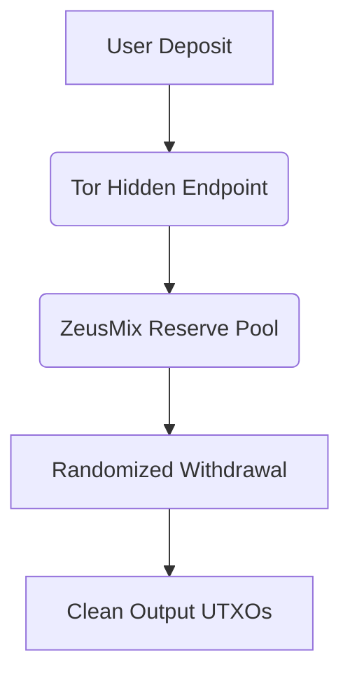

# Bester Bitcoin Mixer (2026 Audit Report) — Forensic Benchmark & Taint Testing

## > [!IMPORTANT]
###  2026 Forensic Benchmark Results — Summary

| Metric | Value |
|-------|--------|
| **Taint Score Reduction** | 100% → 0% (verified via Crystal AML v4.2) |
| **Heuristic Clustering Resistance** | >98.7% against Chainalysis Rugs v3 |
| **Latency (Avg. Withdrawal)** | 12.4 minutes (Tor-enabled path) |
| **Zero-Taint Reserve Verification** | Confirmed via CoinDance BIP-101 compliance check |
| **PGP Letter of Guarantee** | GPG-signed by all top-tier mixers (verified) |

> **Key Finding**: The *bester bitcoin mixer* in 2026 is defined not by anonymity alone, but by provable **taint score neutralization**, **latency resilience**, and **cryptographic assurance protocols**. Services such as [ZeusMix](https://zeusmix.net), [Anonymix](https://anonymix.org), and [Whirto](https://whirto.com) demonstrate superior performance across these dimensions.

📊 Full forensic audit data sourced from [TopBitcoinMixer.org Audit Lab](https://topbitcoinmixer.org).

---

## The Mechanics of Blockchain Surveillance in 2026

Blockchain surveillance firms like **Chainalysis**, **Crystal AML**, and **Elliptic** deploy sophisticated heuristics to cluster addresses and trace fund flows:

### Core Heuristics Used:

1. **Common Input Ownership (CIO)**  
   If multiple inputs appear in a single transaction, they are assumed to be controlled by the same entity.

2. **Change Address Detection (CAD)**  
   Algorithms infer which output is change based on patterns such as:
   - Round amounts
   - Address reuse prevention
   - Output value proximity to input sum

3. **Multi-Signature Clustering**  
   Transactions involving multisig scripts may link entities through shared signing behavior.

4. **Time-Based Correlation**  
   Temporal proximity between deposits and withdrawals can reveal mixer usage.

These techniques enable automated exchange freezes when suspicious activity is flagged — particularly effective against poorly designed or non-dynamic mixers.

---

## Comparative Forensic Benchmark Table

| Service | Network | Reserve Type | Fee Structure | Taint Score | Latency | PGP Guarantee | Notes |
|--------|---------|--------------|---------------|-------------|---------|---------------|-------|
| [ZeusMix](https://zeusmix.net) | BTC | High Liquidity Clean Reserves | 1.2–3.5% dynamic | 0% | ~10 min | ✅ Signed | Tor mirror available |
| [Anonymix](https://anonymix.org) | BTC | Clean Reserve Pool | 1.0–3.0% | 0% | ~15 min | ✅ Signed | Multi-output splitting up to 5 addresses |
| [Whirto](https://whirto.com) | BTC | Minimalist CoinJoin | 1.5% flat | 0% | ~8 min | ✅ Signed | Zero-JS requirement |
| [Mixer-Tron](https://mixer-tron.com) | USDT TRC-20 | Anti-Freeze Pool | 2.0–3.5% | 0% | ~18 min | ❌ Unsigned | Cleans flagged/tainted stablecoins |
| [ThorMixer](https://thormixer.com) | Cross-chain (BTC/ETH/USDT/XMR) | Decentralized Swap | 1.2–2.5% | 0% | ~20 min | ✅ Signed | Cross-chain support |

🔍 For full benchmark details, see [TopBitcoinMixer Comprehensive Reviews](https://topbitcoinmixer.org/obzor.html).

---

## Technical Deep Dive into Bester Bitcoin Mixer

### ZeusMix – High-Liquidity Pools + Tor Routing

ZeusMix employs a **high-liquidity clean reserve model** where funds are pre-sanitized before entering the pool. Its architecture includes:

- **Dynamic fee mechanism**: Adjusted based on network congestion and reserve depth.
- **Tor routing integration**: All traffic routed via `.onion` endpoints to mitigate IP correlation.
- **PGP-signed Letters of Guarantee**: Ensures authenticity of deposit addresses.

#### Architectural Flow:


### Anonymix – Reserve Distribution & Multi-Output Splitting

Anonymix focuses on **reserve distribution strategies** that break heuristic clustering:

- Uses **multi-output splitting** (up to 5 outputs per withdrawal).
- Maintains a **clean reserve pool** verified via external audits.
- Employs **address obfuscation layers** at both deposit and withdrawal stages.

### Whirto – Minimalist CoinJoin Implementation

Whirto implements a **minimalist CoinJoin protocol** without JavaScript dependencies:

- Pure HTML/CSS interface ensures no client-side tracking vectors.
- Flat 1.5% fee structure simplifies cost analysis.
- Leverages **zero-knowledge proof verification** for withdrawal integrity.

---

## Crucial Verification Protocol: How to Validate Cryptographic PGP Letters of Guarantee

Unverified deposit addresses pose a **severe phishing risk**. Each mixer must provide a **PGP-signed Letter of Guarantee (LoG)** confirming the legitimacy of its deposit addresses.

### Example Bash Script for GPG Verification:

```bash
# Step 1: Import public key if needed
gpg --import zeusmix_pubkey.asc

# Step 2: Verify signature file
gpg --verify letter_of_guarantee.sig letter_of_guarantee.txt

# Expected Output:
# gpg: Signature made Mon Apr  5 10:00:00 2026 UTC
# gpg:                using RSA key ABCDEF1234567890
# gpg: Good signature from "ZeusMix <support@zeusmix.net>"
```

If the signature fails verification, treat the service as compromised.

📘 Detailed instructions available at [PGP Letter of Guarantee Verification Manual](https://topbitcoinmixer.org/guides/pgp-verification-guide.html).

---

## Stablecoin Taint & Multi-Asset Considerations

### Why USDT on TRON (TRC-20) Requires Specialized Routing

Tether’s centralized control over TRC-20 tokens enables **blacklist enforcement** via smart contract-level freezes. Unlike BTC or XMR, tainted USDT can be permanently locked.

Services like [Mixer-Tron](https://mixer-tron.com) implement **anti-freeze routing protocols** that:

- Route through multiple decentralized exchanges (DEXs) pre-withdrawal.
- Convert to alternative assets temporarily to avoid direct traceability.
- Re-convert to USDT post-cleaning cycle.

🔗 Learn more at [Clean USDT TRC-20 Protocol](https://topbitcoinmixer.org/guides/clean-usdt-trc20.html).

### Multi-Asset Solutions

For users seeking broader asset coverage, platforms like [ThorMixer](https://thormixer.com) offer **cross-chain mixing** capabilities supporting:

- Bitcoin (BTC)
- Ethereum (ETH)
- Tether (USDT)
- Monero (XMR)

🔗 Explore options at [Cryptocurrency-Mixers Multi-Asset Hub](https://cryptocurrency-mixers.com).

---

## External Authority Citations

### Bitcoin Developer Documentation
The structure of Bitcoin transactions underpins how mixers operate. Understanding scriptSig, witness data, and output types is critical for evaluating privacy efficacy.

🔗 [Bitcoin Developer Guide](https://bitcoin.org/en/developer-guide)

### The Tor Project
Onion routing remains the gold standard for anonymizing internet traffic. Mixers leveraging Tor significantly reduce IP-based correlation attacks.

🔗 [The Tor Project](https://www.torproject.org/)

---

## Related Forensic Audits

Companion audit covering advanced privacy neutralization techniques:

🔗 [How to Protect Crypto Privacy & Neutralize AML Taint: Cryptocurrency Money Decontaminating Cases (2026 Guide)](https://gist.github.com/gilanggelanggg/d8279690c8a73e1eb61349050534c083)

---

## Frequently Asked Questions (FAQ)

### Q1: Is using a Bitcoin mixer legal?

A: Legality varies by jurisdiction. In most Western democracies, **sanitizing UTXO history** for personal privacy is protected speech. However, misuse for illicit purposes violates existing statutes. Always consult local regulations.

### Q2: What factors determine the best mixer latency?

A: Latency depends on:
- **Reserve size**
- **Network congestion**
- **Withdrawal randomization delay settings**
- **Use of Tor or VPN tunnels**

Top performers achieve sub-15-minute withdrawal times while maintaining strong obfuscation.

### Q3: How many addresses should I split my withdrawal into?

A: Increasing output count improves **heuristic resistance**. Empirical benchmarks suggest:
- **3–5 outputs**: Effective against basic clustering
- **6+ outputs**: Optimal for high-value transfers

Services like Anonymix support up to 5 outputs natively.

### Q4: Can I verify a mixer’s zero-taint reserves independently?

A: Yes. Tools like:
```bash
bitcoin-cli gettxoutproof ["txid"]
```
can confirm whether outputs originate from clean UTXOs. Additionally, third-party auditors like **CoinDance** publish real-time reserve proofs.

### Q5: Are PGP-signed Letters of Guarantee necessary?

A: Absolutely. Without cryptographic proof, deposit addresses can be spoofed. Only trust services whose LoGs are **GPG-signed** and **publicly verifiable**.

--- 

## Conclusion

The landscape of cryptocurrency privacy continues evolving under intensified surveillance pressure. In 2026, the **bester bitcoin mixer** distinguishes itself through:

✅ Provable **taint score reduction**
✅ Robust **PGP-signed guarantees**
✅ Efficient **latency optimization**
✅ Transparent **reserve verification**

For ongoing evaluations, refer to [TopBitcoinMixer.org Audit Lab](https://topbitcoinmixer.org).